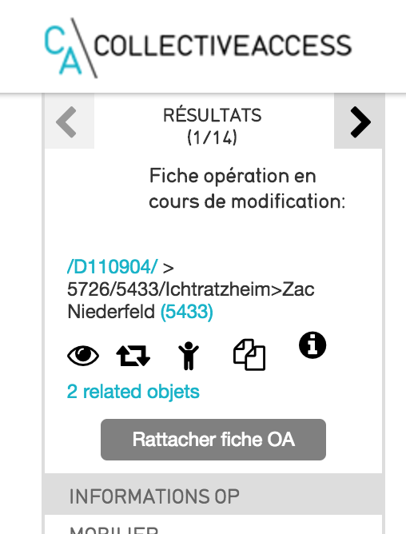
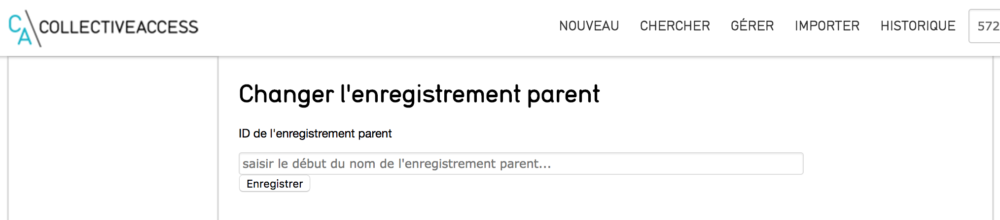
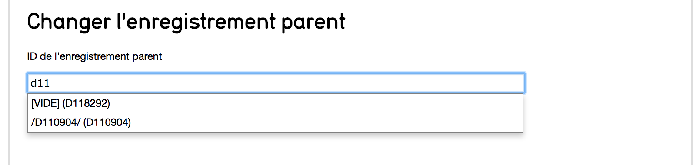
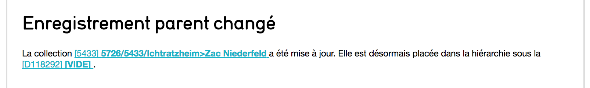

# changeParent
plugin for CollectiveAccess Providence, adding a button to select a new parent record for current record

## How to

This plugin adds a button in the widget zone, allowing to pick a parent record.

On the next screen, you search for a parent record, inside the proper type you've configured inside changeParent.conf file.

A dropdown appears on screen when you'll have entered at least 3 characters. Pick the one you want and validate.

This action finishes on a result screen giving you back two links, to the new parent record and the one you where upon.